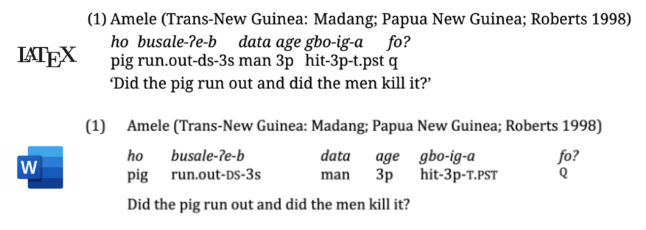

pandoc-glossify
-------------------

A Pandoc markdown filter for typesetting linguistic examples and interlinear glosses.
Embrace the convenience and power of Pandoc's markdown to write your papers!

**Attention**: this is pre-release software which contains bugs and behavior that
is subject to change. You will help me to make `pandoc-glossify` better by reporting
issues you encounter and contributing feedback. 

#### Features

 - [x] Word (docx) and LaTeX (pdf) output support (html coming soon!)
 - [x] interlinear glosses with automatic formatting according to Leipzig Glossing Rules
 - [x] numbered sub-examples
 - [x] grammatically judgements
 - [x] no special markup to learn

Markdown with pandoc is great for writing academic papers, as it offers intuitive 
text formatting, state of the art support for citations and mathematical formulas, 
and can be used to produce documents in different format — from LaTeX to Word — 
depending on what your editors or collaborators want. With `pandoc-glossify` all 
of this flexibility and convenience is now available to linguists as well. 

Simply write your examples and glosses inside markdown's fenced code blocks, like this:

~~~
```gloss
Amele (Trans-New Guinea: Madang; Papua New Guinea; Roberts 1998)
ho   busale-ʔe-b   data age gbo-ig-a     fo?
pig  run.out-DS-3s man  3p  hit-3p-T.PST Q
'Did the pig run out and did the men kill it?'
```
~~~

To produce nicely rendered Word and LaTeX documents!




### Usage

To process linguistic examples in your markdown documents, simply place the 
file `pandoc-glossify.lua` in your project folder and invoke pandoc with the 
option `--lua-filter pandoc-glossify.lua`{.sh} in addition to your normal invocation.

For example:

```sh
pandoc document.md --lua-filter pandoc-glossify.lua --citeproc -o document.tex
pandoc document.md --lua-filter pandoc-glossify.lua --citeproc -o document.pdf
pandoc document.md --lua-filter pandoc-glossify.lua --citeproc -o document.docx
```

`pandoc-glossify` will process markdown fenced blocks with the style `gloss` as well 
as citations in the form `@gloss:label`. See the examples subsection for details. 

#### Interlinear glosses

Linguistic examples and interlinear glosses are written inside a fenced markdown block 
that is annotated with the class `gloss`. Both the shorthand form (using a single 
`gloss` labels after the backticks) and the extended form (using an attribute list 
`{.gloss}`) are accepted:

~~~
```gloss

```
~~~

or

~~~
```{.gloss}

```
~~~

Examples themselves have a very simple structure. To write an interlinear gloss, 
simply type in aligned text (examples from the 
[Leipzig Glossing Rules document](https://www.eva.mpg.de/lingua/pdf/Glossing-Rules.pdf)). 
The text will be formatted automatically (this includes typesetting every gloss component
that looks like THIS as small caps). 

~~~
```{.gloss}
n=an     apedani     mehuni
CONN=him that.DAT.SG time.DAT.SG 
'They shall celebrate him on that date.'
```
~~~

You can also add a preamble/header, which can contain simple markup (in this case, 
a citation)

~~~
```{.gloss}
Indonesian [@Sneddon1996]
Mereka di Jakarta  sekarang.
they   in  Jakarta now 
'They are in Jakarta now.'
```
~~~

If your preamble is more than a single line long, put it in a preceding paragraph, 
separated from the example by an empty line 

~~~
```{.gloss}
Indonesian, as found in 
@Sneddon1996 on page 237

Mereka di Jakarta  sekarang
they   in  Jakarta now 
'They are in Jakarta now.'
```
~~~

Translation block can also be more complex and contain markup. 

~~~
```{.gloss}
Nepali (Bickel 2010)

yahã ā-era    khānā     khā-yo?
here come-CVB food[NOM] eat-3sM.PST

'Did he come here and eat?' 
*or* 'Did he eat after coming here?' 
(presupposing either 'he came' or 'he ate')
```
~~~

#### Sub-examples

Multiple sub-examples can be combined together using the markdown nested list forms, like
this

~~~
```{.gloss}
This illustrates an example with multiple sub-examples

a. Nepali (Bickel 2010) 
   
   yahã ā-era    khānā     khā-yo?
   here come-CVB food[NOM] eat-3sM.PST

   'Did he come here and eat?' 
   *or* 'Did he eat after coming here?' 
   (presupposing either 'he came' or 'he ate')

b. Indonesian (@Sneddon1996)

   Mereka di Jakarta  sekarang
   they   in  Jakarta now 
   'They are in Jakarta now.'

c. Hittite (Lehmann 1982:211)
   n=an     apedani     mehuni
   CONN=him that.DAT.SG time.DAT.SG 
   'They shall celebrate him on that date.'
```
~~~

#### Simple examples and grammaticality judgements

`pandoc-glossify` also supports simple linguistic examples and grammaticality judgements:

~~~
```gloss
a. Der Anwalt, den der Zeuge, den der Spion betrachtete, schnitt, überzeugte den Richter.
b. *Der Anwalt, den der Zeuge, den der Spion betrachtete, überzeugte den Richter.
```
~~~

Of course, the grammaticality judgements also work with glossed examples

~~~
```gloss
? The cat   ate     the dog
  ART cat.N eat.PST ART dog.N
```
~~~

#### References

You can refer to examples using the built-in Pandoc citation mechanism. Example
references always start with `@gloss:`. You can use the deictic pronouns `@gloss:last`
or `@gloss:next` to refer to the previous or the next example, respectively (note:
you can also use references like `@gloss:last-5`). 

Alternatively, you can give examples their individual identifiers, like this:

~~~
```{#important .gloss}
The cat   ate     the dog
ART cat.N eat.PST ART dog.N
```
~~~

You can refer to such examples using their label: `@gloss:important`. 

### Output formats and customization

#### docx (MS Word and other Office-like software)

Formatting interlinear glosses in Word is particularly challenging since to achieve 
good results one has to use tables. `pandoc-glossify` does this for you. It creates
tables with variable-length columns to fit the glosses. This works reasonably well
most of the time, but unfortunately, the software does not have access to precise
text metrics, which means that some examples might look a bit out of place. Please
use LaTeX and PDF output if you want to produce best-looking documents. The Word
output is intended primarily for submission to journals that require it, where the
document will be professionally typeset anyway. 

Future version of `pandoc-glossify` will offer various parameters that will allow
you to tweak the table layout to achieve better results in your specific case.

#### LaTeX (high-quality PDF output)

`pandoc-glossify` does not rely on any additional LaTeX packages, which was an
important design criterion. This means you do not packages like `expex` or `gb4e`
to typeset the glosses. Instead, `pandoc-glossify` writes the glosses directly
as a sequence of vertically aligned material (boxes), which allows it to be more
flexible. 

TODO: describe LaTeX customization options. 

### Alternatives

`pandoc-glossify` is not the first work of this kind, there are other tools for
providing linguistic example functionality with markdown. In particular, 
[`pangloss`](https://github.com/daemanos/pangloss) provides a convenient wrapper 
for the LaTeX package `gb4e` with automatic features like gloss formatting. 
Michael Cysouw's [`pandoc-ling`](https://github.com/cysouw/pandoc-ling) is a
comprehensive solution for different types of linguistic examples that relies
on special features of Pandoc's markdown. 

What sets `pandoc-glossify` aside is that it aims to solve practical problems of 
linguistic with markdown while retaining the magical "it just works and looks right"
feeling. Many journals still insist on submission in doc format, and setting up
bibliographic references and interlinear glosses in Word is a huge pain. Therefore
docx support is of absolute importance. Second, `pandoc-glossify` implements its own
parser and interlinear gloss detector, which allows the examples to be written in an 
intuitive fashion without sacrificing flexibility. 

